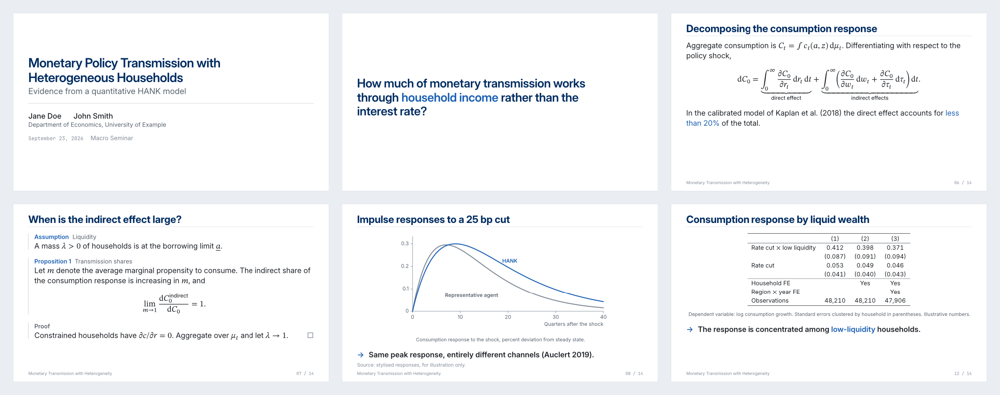

# brownbag

Minimal academic presentation theme for [Typst](https://typst.app) and
[Touying](https://touying-typ.github.io), aimed at talks in economics,
econometrics, and macroeconomics.

> Work in progress. `brownbag` is a working name and the package is not yet
> published to Typst Universe.



The slides above are from [`examples/seminar.typ`](examples/seminar.typ).

## Quick start

You need [Typst](https://github.com/typst/typst#installation) 0.12 or later
(0.15 recommended) and the three [fonts](#fonts). Touying is downloaded by
Typst on first compile.

1. **Install the theme as a local package.** Until it is on Typst Universe,
   clone it into Typst's local package directory:

   ```sh
   # macOS
   git clone https://github.com/andrerecio/typst-academic-slides \
     ~/Library/Application\ Support/typst/packages/local/brownbag/0.1.0

   # Linux
   git clone https://github.com/andrerecio/typst-academic-slides \
     ~/.local/share/typst/packages/local/brownbag/0.1.0
   ```

   On Windows the directory is `%APPDATA%\typst\packages\local\brownbag\0.1.0`.

2. **Write a deck.** Anywhere on your machine, create `talk.typ`:

   ```typst
   #import "@local/brownbag:0.1.0": *

   #show: brownbag-theme.with(
     config-info(
       title: [My Talk],
       author: "Jane Doe",
       institution: [University of Example],
       date: datetime.today(),
     ),
   )

   #title-slide()

   = Introduction        // section slide

   == First slide        // content slide

   - A point.

   #pause

   - A second point, revealed on the next step.
   ```

3. **Compile it** to `talk.pdf`, or recompile on every save:

   ```sh
   typst compile talk.typ
   typst watch talk.typ
   ```

   Present the PDF with any viewer's full-screen mode. In VS Code, the
   [Tinymist](https://github.com/Myriad-Dreamin/tinymist) extension gives a
   live preview.

Alternatively, without installing anything: copy `lib.typ` and `src/` next to
your deck and use `#import "lib.typ": *`. On [typst.app](https://typst.app),
upload those files and the fonts to the project.

Decks are written in Typst. There is no Quarto format: Quarto can output Typst,
but it goes through Pandoc's own template, and this theme ships no Quarto
extension for it.

## A fuller example

```typst
#import "@local/brownbag:0.1.0": *

#show: brownbag-theme.with(
  accent: "blue",   // or any color, e.g. rgb("#8c2131")
  config-info(
    title: [Monetary Policy Transmission with Heterogeneous Households],
    short-title: [Monetary Transmission],       // shown in the footer
    author: ("Jane Doe", "John Smith"),      // a string, or an array of strings
    institution: [University of Example],
    date: datetime.today(),
  ),
)

#title-slide(extra: [Macro Seminar])

#focus-slide[How much of transmission works through #alert[income]?]

= Model               // section slide

== The household problem   // content slide

$ V_t (a, z) = max_(c, a') u(c) + beta EE_t [V_(t+1) (a', z')] $

#pause

- Reveals, `#alert[..]`, columns and the rest are Touying's.
```

## Options

| Argument | Default | |
|---|---|---|
| `accent` | `"blue"` | `"blue"`, `"green"`, `"burgundy"`, `"purple"`, `"orange"`, `"mono"`, or any color. Titles take a near-black shade of the same hue (navy for blue); `"mono"` keeps them black |
| `aspect-ratio` | `"16-9"` | or `"4-3"` |
| `footer` | `auto` | `auto` shows the short title; `none` leaves only the slide counter |
| `text-size` | `20pt` | Body text size; see [Dense slides](#dense-slides) |

Any Touying `config-*(..)` dictionary can be passed as an extra positional
argument:

```typst
#show: brownbag-theme.with(
  config-common(handout: true),                          // one page per slide
  config-methods(cover: utils.semi-transparent-cover),   // dim, rather than hide, unrevealed content
)
```

## Slides and helpers

| | |
|---|---|
| `= Section` | Section divider with an accent number. |
| `== Title` | Content slide. Everything until the next heading is its body. |
| `#title-slide(extra: ..)` | Built from `config-info`. `extra` is a last line such as the venue or "Joint with …". |
| `#focus-slide[..]` | One large statement: the research question, the takeaway, "Thank you". |
| `#muted[..]` | De-emphasised text, e.g. a subtitle on the first line of a slide. |
| `#alert[..]` | The accent color. `*strong*` is weight only. |
| `#keypoint[..]` | The one sentence to remember from the slide. |
| `#source[..]` | "Source: …" line at the bottom of the slide. Put it last. |
| `#goto(<label>)[..]` | Link to a backup slide, which gets a "Back" link. See below. |
| `#cols[..][..]` | Columns. Extra arguments go to `grid`: `columns: (2fr, 3fr)`, `align: horizon`. |
| `#outline()` | Roadmap of the sections. See below. |

### Results, assumptions, proofs

```typst
#assumption(title: [Strict exogeneity])[ $EE[epsilon_(i t) | x_i, alpha_i] = 0$ ]

#pause

#proposition(number: 1, title: [Consistency])[ The FE estimator is consistent as $N -> oo$. ]

#proof[ Apply the law of large numbers to the within-transformed moments. ]
```

Available: `assumption`, `definition`, `proposition`, `theorem`, `lemma`,
`corollary`, `remark`, `example`, `proof`. `title` and `number` are optional.
Numbers are set by hand (`number: 2`, `number: "A.1"`) to match the paper;
there are no automatic counters. `#pause` works inside a statement.

### Figures

Use Typst's own `figure`. Figures are unnumbered. An image with no explicit
size takes whatever height the rest of the slide leaves free, so this just
fits, with the takeaway and the source still on the slide:

```typst
== Impulse responses

#figure(image("irf.pdf"), caption: [Percent deviation from steady state.])

#keypoint[Same peak response, different channels.]

#source[own calculations.]
```

- Give the image a `width:` or `height:` and it is left exactly as you sized it.
- If so much text surrounds the figure that it would be squeezed below about
  half the slide, the overfull-slide warning fires (see below).
- Text beside a figure, or two figures side by side, use `#cols`. With a
  figure inside, the columns take the remaining height of the slide:

  ```typst
  #cols(columns: (2fr, 3fr), align: horizon)[
    - Consumption peaks after four quarters.
    - The response is more persistent in HANK.
  ][
    #figure(image("irf.pdf"))
  ]
  ```

- Several panels under one caption:
  `#figure(grid(columns: 2, gutter: 1em, image("a.pdf"), image("b.pdf")), caption: [..])`.

### Roadmap

`#outline()` lists the sections, numbered like the section slides, without
leaders or page numbers, and leaves out backup sections. Put the same two
lines at the start of a section and that section is highlighted while the
others are dimmed:

```typst
== Roadmap

#outline()
```

### Regression tables

Use Typst's own `table` inside a `figure`; the caption doubles as the table
note.

```typst
#figure(
  table(
    columns: 3,
    table.header[][(1)][(2)],
    [Rate cut], [0.053], [0.049],
    [],         [(0.041)], [(0.040)],
    table.hline(stroke: 0.5pt),        // a \midrule
    [Observations], [48,210], [48,210],
  ),
  caption: [Standard errors clustered by household in parentheses.],
)
```

Tables get heavy top and bottom rules, a light rule under the first row and no
vertical lines. For a header with several rows, pass `stroke: none` to `table`
and place `table.hline()` yourself; the outer rules stay.

Numeric cells (`0.412`, `(0.087)`, `48,210`, `-0.41***`, `12%`) are typeset for
alignment: fixed-width digits, a true minus sign in place of a hyphen, and
significance stars balanced by an invisible copy on the left, so a starred
coefficient stays centred over the standard error beneath it. Write a number as
plain text, `[-1.0]`, not as math, `$-1.0$`, to keep it in the text font.

**From R.** `modelsummary` (through `tinytable`) writes Typst directly, and its
output needs no editing: it brings its own booktabs rules, which the theme
detects and leaves alone.

```r
modelsummary(models, output = "table.typ", stars = c("*" = .1, "**" = .05, "***" = .01))
```

```typst
== Main results

#include "table.typ"
```

**From Stata, or anything that writes CSV.** Stata has no Typst export, but a
CSV whose first row is the header works, for instance from
`esttab using table.csv, csv plain`. (This recipe was tested with a CSV of that
shape, not with Stata itself; drop extra title or note rows with `.slice`.)

```typst
#let rows = csv("table.csv")

#figure(
  table(
    columns: rows.first().len(),
    table.header(..rows.first()),
    ..rows.slice(1).flatten(),
  ),
  caption: [Standard errors in parentheses.],
)
```

### Mathematics

Equations use STIX Two Math, scaled to match Inter. Words inside an equation,
such as `"direct effect"` under a brace, `"if treated"` in `cases`, or a
`cal(L)_"val"` subscript, are set in Inter, like `\text{}` in a sans-serif
beamer deck; operator names (`max`, `lim`, `arg min`, `log`) stay in the math
font. An inline formula never breaks across lines: it moves to the next line
whole.

### Dense slides

`text-size:` sets the body size for the whole deck; tables, captions, labels
and notes scale with it, while slide titles and the footer do not. For a single
busy slide, scope a smaller size with `#[ .. ]`:

```typst
== A busy slide

#[
  #set text(size: 17pt)

  Everything on this slide is smaller, reveals included.
]
```

A bare `#set text(size: ..)` without the brackets is not confined to its slide
and shrinks every slide after it.

### Citations and references

Citations are author–year (Chicago). `@key` gives "(Auclert 2019)" and
`#cite(<key>, form: "prose")` gives "Auclert (2019)". For the reference list,
use a normal slide, typically after `#show: appendix` so that it does not count
towards the slide total:

```typst
#show: appendix

== References

#bibliography("refs.bib")
```

### Backup slides

Everything after `#show: appendix` is outside the slide total: the main deck
still reads "12 / 12" on its last slide, and backup slides show their number
alone. To jump to a backup slide and return, label its heading and link to it:

```typst
== Main result

The ranking is robust to the borrowing limit. #goto(<robust>)[Robustness]

#show: appendix

== Robustness checks <robust>     // gets a "← Back" link in its footer
```

`#goto` renders as a small "→ Robustness" in the accent color. "Back" returns
to the slide that links here, on its last reveal step so that nothing already
shown disappears. If several slides link to the same backup slide, "Back"
returns to the first of them; a PDF cannot know where you came from. Links
work in any PDF viewer's presentation mode.

### Handout and speaker notes

Both are Touying features and need no theme support:

```typst
#show: brownbag-theme.with(
  config-common(handout: true),                          // one page per slide, reveals collapsed
  // config-common(show-notes-on-second-screen: right),  // notes beside each slide
)

== A slide

Content.

#speaker-note[Mention the calibration before moving on.]
```

`#goto` and "Back" links keep working in handout mode.

### Overfull slides

A slide never spills onto a second page. If its content is too tall, the
compiler warns with the slide number and by how much:

```
[touying] detecting slide content overflow at page 12 (slide 6, subslide 1,
content height: 374.48pt, available height: 355.56pt).
```

(Typst prints this inside an "unknown font family" warning; that is how Touying
emits warnings, not a font problem.) Figure columns also check their final
available height and emit a `[brownbag] detecting column content overflow`
warning if the text beside a figure is too tall. These warnings do not shrink
the content; shorten it or reduce its text size before presenting.

For a slide that is meant to run over
several pages, such as a long reference list, opt out for that slide:

```typst
== References

#slide(config: config-common(breakable: true))[
  #bibliography("refs.bib")
]
```

Title and focus slides do not advance the slide counter. Block quotes
(`#quote(block: true, attribution: ..)`), footnotes, and fenced code blocks are
styled by the theme. `#pause`, `#meanwhile`, `#uncover`, `#only`,
`#alternatives`, `#speaker-note`, and `#show: appendix` are Touying's
and are re-exported.

## Fonts

The theme needs three font families. They are free (SIL Open Font License)
but are **not bundled** with the package, so install them once per machine.

| Role | Family | Fallback if missing |
|---|---|---|
| Body text and headings | [Inter](https://rsms.me/inter/) | Arial |
| Code, slide counter, labels | [JetBrains Mono](https://www.jetbrains.com/lp/mono/) | DejaVu Sans Mono (built into Typst) |
| Mathematics | [STIX Two Math](https://www.stixfonts.org) | New Computer Modern Math (built into Typst) |

**macOS** (Homebrew):

```sh
brew install --cask font-inter font-jetbrains-mono font-stix-two-math
```

**Windows / Linux:** download the families from the links above and install
them for your user, or use your package manager where available (for example
`fonts-inter` and `fonts-jetbrains-mono` on Debian/Ubuntu).

**Check that Typst sees them.** All three names must be printed:

```sh
typst fonts | grep -E "^(Inter|JetBrains Mono|STIX Two Math)$"
```

Typst reads the system font folders directly, so a font that an installer
reported as installed but that is missing from this list will not be used.

**Without a system-wide install,** put the font files in a `fonts/` directory
(git-ignored) and compile with `--font-path fonts`. On
[typst.app](https://typst.app), upload the font files to the project.

Notes:

- A missing family produces a warning such as `unknown font family: inter` and
  the deck still compiles with the fallback. Treat that warning as an error for
  anything you will present: the layout is tuned to Inter's metrics.
- Typst warns about every unknown family in a font list, including unused
  fallbacks. Linux machines without Arial therefore see a harmless
  `unknown font family: arial` warning even when Inter is installed.
- Typst 0.15 renders variable font files (such as `InterVariable.ttf`, which
  the Homebrew cask installs next to the static files) at the correct weights.
  On older Typst versions, install the static `.otf`/`.ttf` files.

## Building the example

```sh
typst compile --root . examples/seminar.typ
typst watch   --root . examples/seminar.typ
```

To regenerate the preview image at the top of this page, after compiling the
example:

```sh
typst compile --root . assets/preview.typ assets/preview.png --ppi 144
```

## Regression checks

With Typst, the fonts above, Python 3, and the Python package `pypdf` installed:

```sh
python3 -m unittest discover -s tests -v
```

The checks compile temporary decks and verify table padding, caption placement,
figure-column overflow, source-line clearance, reveals, and backup links.
They leave no generated decks in the repository.

## License

MIT
